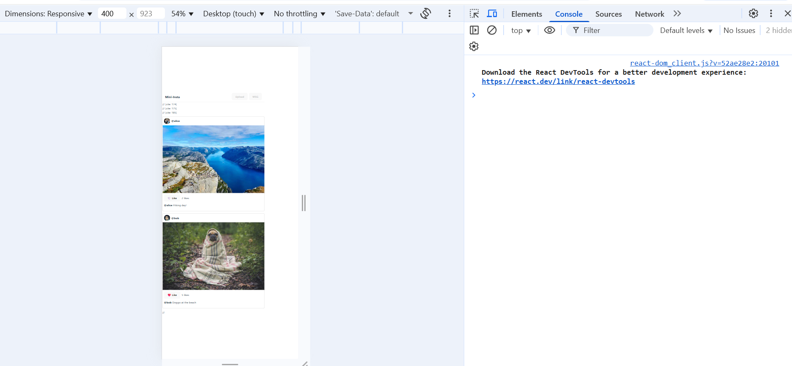
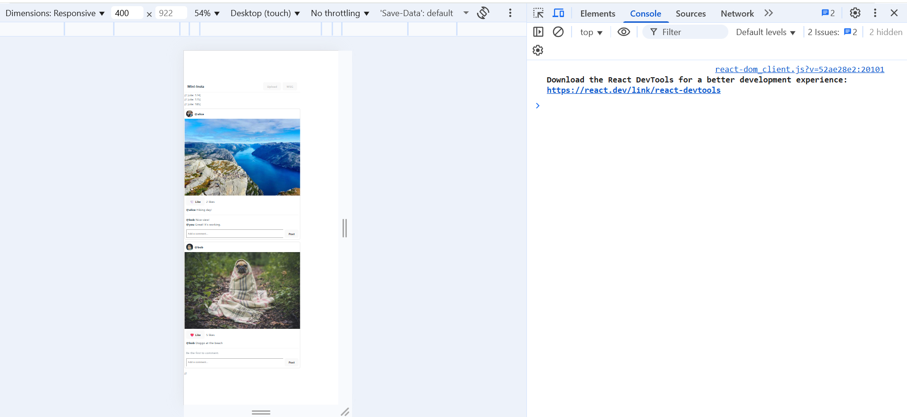
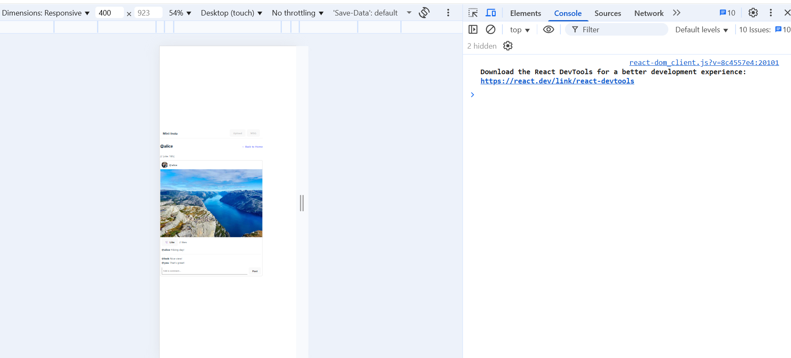
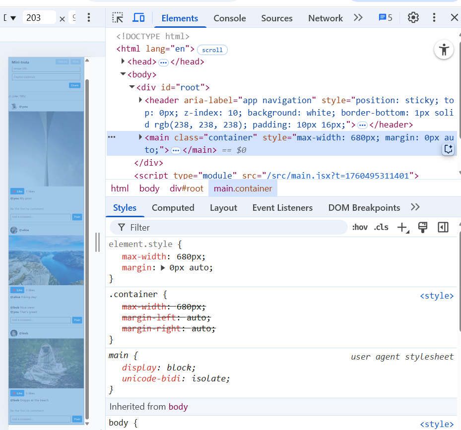
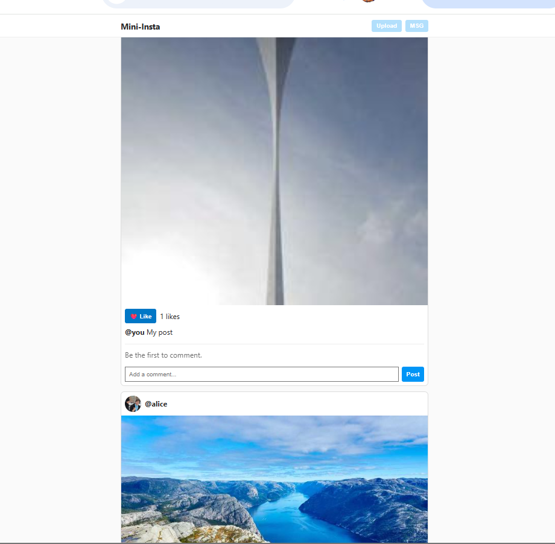
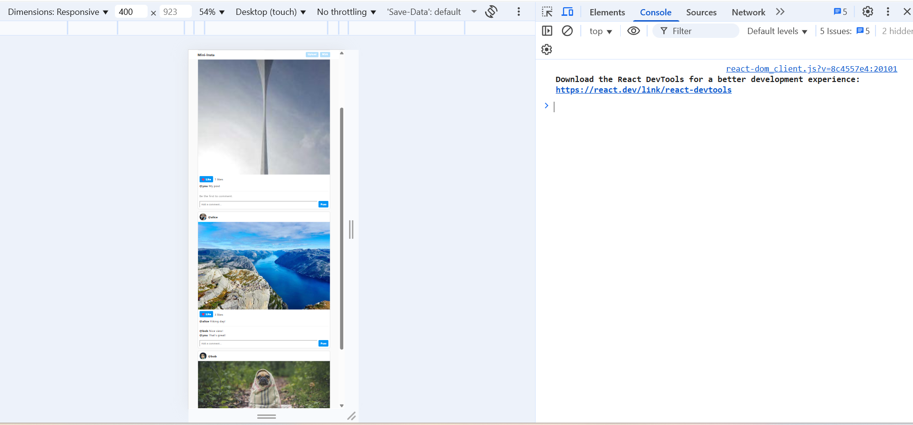

# SLU-stagram - CSCI-4360/CSCI-5360 Lab 2 Submission

This project is a minimal photo-sharing application built with React 18 and Vite, designed to practice core React concepts like component composition, state management, controlled forms, and client-side routing.

The application features a main feed, tappable likes, inline comments, a composer for creating new posts, and for the graduate portion, client-side routing for profile pages and `localStorage` persistence to save all changes across browser sessions.

**Live Deployment URL:**
[https://prismatic-salamander-963cc7.netlify.app](https://prismatic-salamander-963cc7.netlify.app)

---

### Component Tree & State Management

The application's architecture is centered around a single source of truth for the application's data.

* [cite_start]**State Management:** The primary state, the `posts` array, is managed entirely within the main `App.jsx` component using the `useState` hook[cite: 32, 161]. [cite_start]Persistence is achieved by using the `useEffect` hook in `App.jsx` to read from and write to the browser's `localStorage` whenever the `posts` state changes [cite: 905, 912-923].

* **Component Tree:**
    * [cite_start]`App`: The root component that holds all `posts` state and manages the application's routes using `react-router-dom` [cite: 963-965, 980].
        * [cite_start]`Navbar`: A static header component for the application title[cite: 31, 253].
        * [cite_start]`Composer`: A controlled form that receives the `setPosts` function to add new posts to the main state array [cite: 820-823].
        * [cite_start]`Feed`: Receives the `posts` array and renders a list of `PostCard` components [cite: 31, 184-191].
            * [cite_start]`PostCard`: Renders a single post's data and manages user interactions like "liking" a post[cite: 31, 206].
                * [cite_start]`CommentList`: A presentational component that maps over and displays an array of comments[cite: 495].
                * [cite_start]`CommentForm`: A controlled form that allows users to submit new comments for a specific post[cite: 493, 512].
        * [cite_start]`Profile`: A route-specific component that filters the main `posts` array by author and renders the result using the `Feed` component[cite: 904, 1021].

---

### Required Screenshots for Grading

**Part 0: Project Setup**
*This screenshot verifies the initial project setup and that the Vite development server is running correctly.*

**Part 3: Feed and Likes**
[cite_start]*This screenshot demonstrates a stable feed with functioning, independent "like" buttons and a clean console, as required by the checkpoint.* [cite: 482-484]

**Part 4: Comments**
[cite_start]*This screenshot shows a newly added comment appearing correctly under a post, with a clean console.* [cite: 805, 808-809]

**Grad Requirement: Profile Page**
*This screenshot shows the routing functionality working, displaying a filtered feed for a specific user.*

**Polish Section Deliverables**

* **Screenshot A: Layout, Centering & Font**
    [cite_start]*This screenshot verifies the application of global styles from `index.css`, including the system font stack and centered container.* [cite: 1152-1153]
    

* **Screenshot B: Button Hover State**
    [cite_start]*This screenshot demonstrates the required visible hover state on a button.* [cite: 1154]
    

* **Screenshot C: Accessibility Attributes**
    [cite_start]*This screenshot verifies the correct use of `aria-pressed="true"` on a liked button and the presence of descriptive `alt` text on a post image.* [cite: 1155-1157]
    